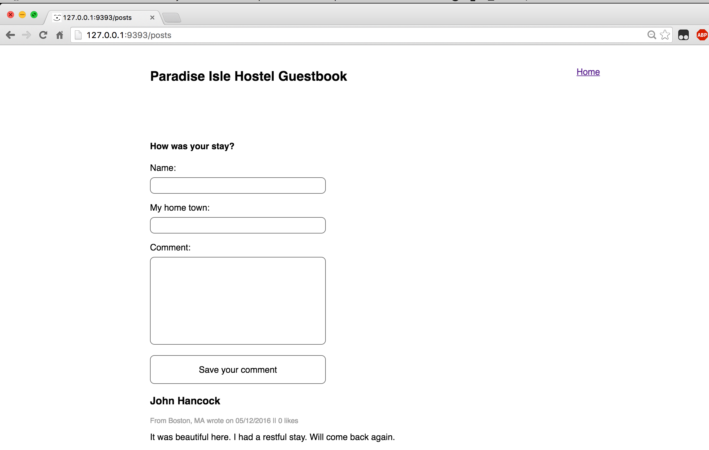
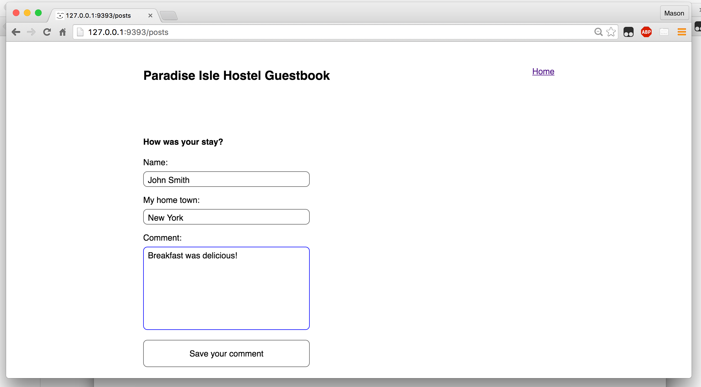
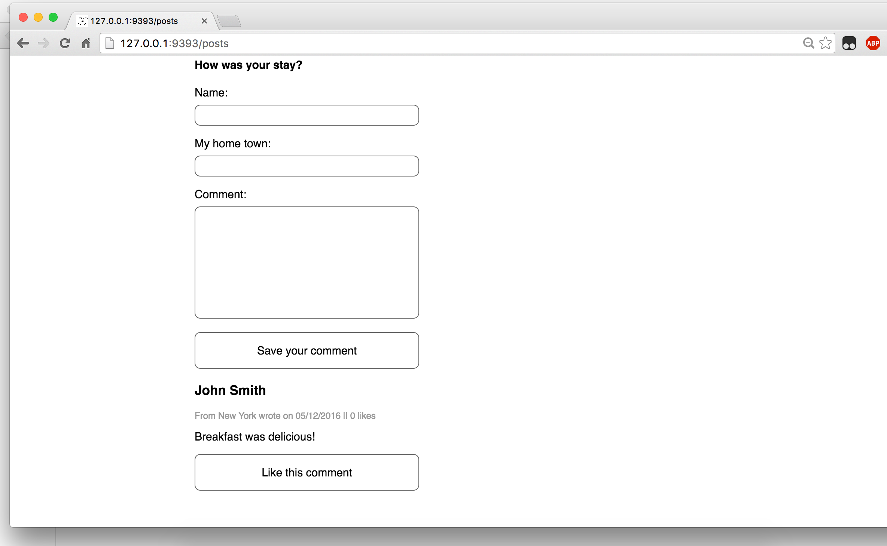

# Part 2:  AJAX

## Summary

In Part 2 we'll take a functioning Sinatra application and enhance the user
experience by adding some AJAX calls.

### User Stories

#### Current Site

The application is a simple site where users can write posts.  If a user wants
to write a post, here's the process.

1. User visits the site root.
2. User clicks on the "Share Your Thoughts" link.
3. User is taken to a new page with a form.
4. User fills out and submits the form.
5. User is taken to a new page where the saved post is displayed.

We recommend try this functionality out for yourself so that you can get a feel
for what the current user experience is.

#### Future Site

Our enhancements will change the experience so the user never
leaves the homepage.  All the requests will be AJAX requests and we'll update
the DOM based on the responses.

## Releases

### Release 0: AJAX

Implement the AJAX enhancements. With AJAX added, the user story should be:

1. User visits the site root.
2. User clicks on the "Share Your Thoughts" link.
3. The link is no longer visible on the page.
4. In place of the link is the form for writing a new post.
5. User fills out and submits the form.
6. Details of the saved post are added to the DOM.
7. The form is removed from the DOM.
8. The "Share Your Thoughts" link is again visible.

Since this is all AJAX, the page should never need to reload!

## Screenshot Walkthrough

Starting out, things are pretty normal.

After clicking the "Share Your Thoughts" link, we should see the form (note: we
don't have the header from the normal new post page).

Once we submit, our form goes away but we should have the post shown on the page.

