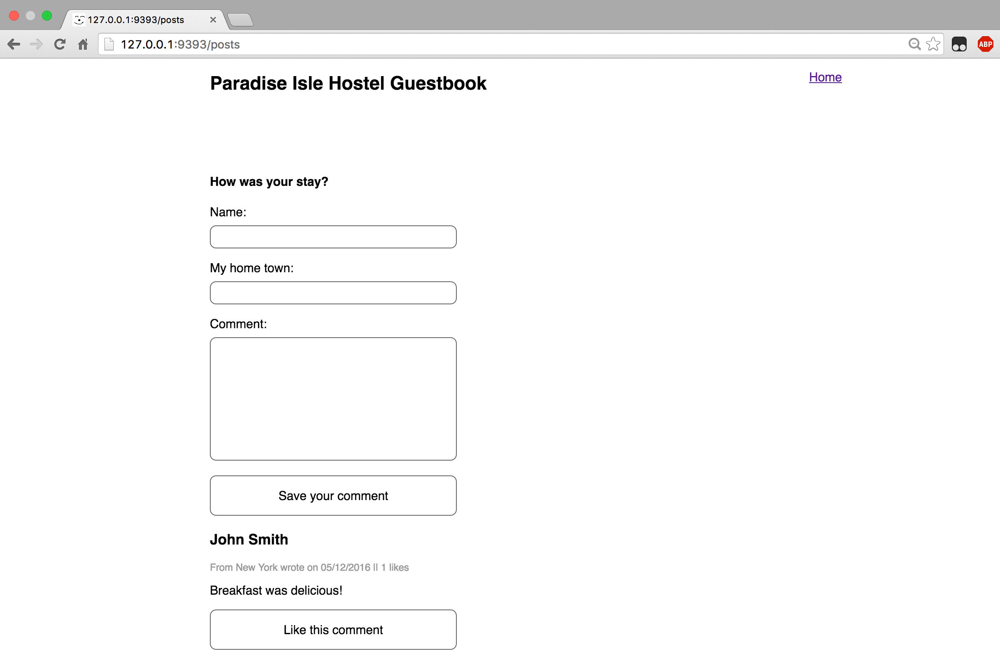

# Part 2:  AJAX

## Summary
In Part 2 we'll take a functioning Sinatra application and enhance the user
experience by adding some AJAX calls.

### User Stories

<a name="current_site">

#### Current Site

The application is a simple guestbook for a youth hostel.  The guests can post
comments on the guestbook.  If a user wanted to post a comment, here's the
process.

User visits the site root.

***

User fills out and submits the form.

***

User is taken back to the guestbook page where the saved comment is displayed.

<a name="future-site">

#### Future Site

Our enhancements will make it so the user never leaves the homepage.  All the
requests will be AJAX requests, and we'll update the DOM based on the
responses.  After the site is updated, here's what the user experience will be.

User visits the site root.

User fills out and submits the form. Details of the saved comment are added to
the DOM (without refreshing).

Note that the form is also reset to allow another comment.

##### Liking

1. User visits the site root.
1. User clicks on a like button.
1. The "like" count is incremented on the DOM.

### Release 0: AJAX Post Addition

Implement code to make the page function as described in
[Future Site](#future-site) section.

### Release 1: Add Liking

Build on work work from Release 0 and add the capability to add a new post and
then "Like" it. No refresh of the page should be required to make this
possible.

### Release 2: Graceful Degradation

When applying JavaScript, we should so so in a way that, when JavaScript is
disabled, the basic functionality of the application still works. Try disabling
JavaScript in Chrome and then visit the [http://localhost:9393/](http://localhost:9393/)
again.

## Conclusion

Once all the tests have passed, you have completed Part 2 of the assessment. If
you haven't done so already, commit your changes and move on to Part 3.
