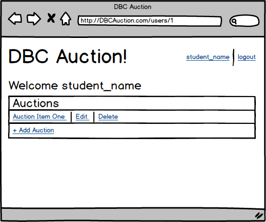
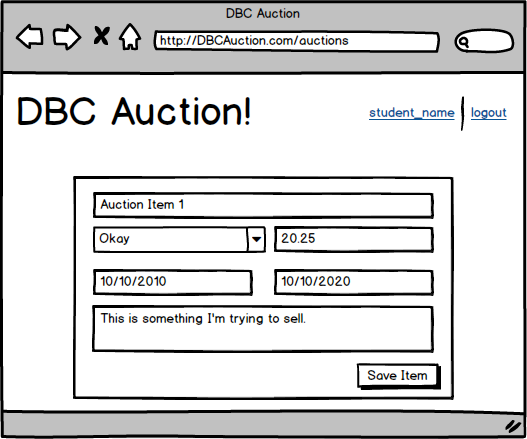
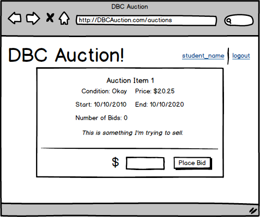
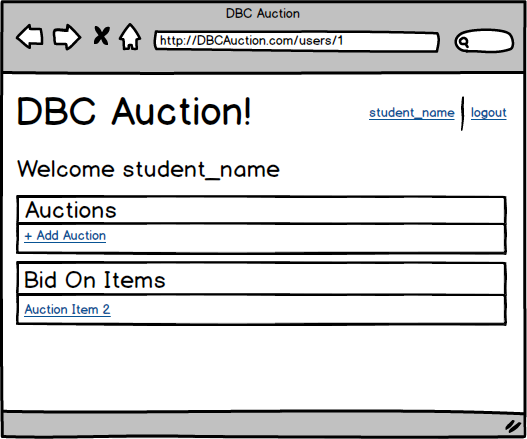

# Part 3: Build a CRUD App

## Summary

In Part 3 of the assessment, you'll build a web-stack application:  controllers, views, user authentication, database migrations, model validations, associations, etc.  Even a little bit of CSS.  This is an opportunity to demonstrate your proficiency in the core skills from Phase 2.

### Completing Part 3
Part 3 is the final part of the Phase 2 assessment.  If Parts 1 and 2 are finished, devote the rest of the day to completing as much of this application as possible.  The assessment might end before the entire application is built.  If time is running out and it looks like the app will not be completed, continue to work through the releases in order and make as much progress as you can.  Use your time wisely:  if you're stuck,  ask questions and get help.

### Web Application Overview
We'll be building a simplified version of a blind auction site—in a blind
auction, bidders do not see how much other bidders have bid.  Users will be able to register with the site, list items for auction, bid on items, etc.  We'll build the site one feature at a time.  The requirements for each feature are described in more detail in the *Releases* section.

## Releases
The releases describe features to build out in your web application.  Each release will describe what to build, not how to build it.  Apply best practices.  For example, the releases contain mockups of the application.  In the mockups, the URLs are omitted from the browser's address bar.  You should determine the appropriate path for each page based on the conventions / patterns you've learned in Phase 2.

### Pre-release: Setup
Make sure that everything is set up before we begin working on the application: install any necessary gems and create the database.  From the command line, navigate to the `part-3` directory of the Phase 2 assessment.  Once there, run ...

0. `$ bundle`
0. `$ bundle exec rake db:create`

### Release 0: User Registration
The first feature to build is user registration, which allows users to create new accounts.  What are best practices for user registration?  What routes do you need?  How can you keep user data safe?

On the homepage, add a "register" link.  Clicking the link takes the user to a page with a form for creating a new account.  Users must register with an e-mail address, a username, and a password.  The e-mail address and username must be unique.

If registration is unsuccessful, the user should see the registration form and the associated error messages.  If registration is successful, the user should be considered logged in and redirected to the homepage where the "register" link is replaced with the user's username.  This is demonstrated in Figure 1.

  
*Figure 1*. Registering unsuccessfully and then successfully.

### Release 1: Login/Logout
Now that users can register, allow them to login and logout.  On the homepage, add a "login" link next to the "register" link.  Clicking the link takes the user to a page with a form for logging in.  Users sign in with an e-mail address and password.

If login is unsuccessful, the user should see the login form and an error message.  If login is successful, the user should be considered logged in and redirected to the homepage where the "login" and "register" links are replaced with the user's username and a "logout" link.

Clicking the "logout" link logs the user out and redirects the user back to the homepage.  These behaviors are demonstrated in Figure 2.

  
*Figure 2*. Logging in unsuccessfully, logging in successfully, and logging out.

### Release 2: User Profile Page
Now that the application supports users, let's create a page to show a user's profile.  On the homepage, if a user is logged in, make the username a link.  Clicking the link takes the user to the profile page, which for now is a simple page welcoming the user.  This is demonstrated in Figure 3.

  
*Figure 3*.  Logging in and visiting the profile page.

### Release 3: List Items for Auction
Add a feature to allow users to list items to put up for auction.  Use the profile page for managing a user's listed items.

On the user profile page, add a link for listing a new item.  Clicking the link takes the user to a form.  The form should collect data like the item's name, the item's condition, and a description of the item.  It should also collect start and end times for the auction.

When the form is submitted, if listing the item is unsuccessful, the user should see the form and the associated error messages.  If listing the item is successful, the user should be redirected to the profile page where the item is listed by name.  This is demonstrated in Figure 4.

*Note*: To set start and end times for an auction, you'll be working with dates.  The HTML5 datetime input type can be tricky to use with ActiveRecord.  Consider using a text input and entering the times as strings formatted so that ActiveRecord can parse them: `YYYY-MM-DD` or `YYYY-MM-DD HH:MM:SS` (e.g., 2015-04-01 14:30:00).

  
*Figure 4*.  Listing an item unsuccessfully and then successfully.

### Release 4: Other -RUD Items

#### Reading Items

_Given:_

* The registered user is signed in
* There exist previously-created items

1. Create a section on the profile page to display all the items. This section
   should _not_ include the long form description of the item.

#### Updating Items

_Given:_

* The registered user is signed in
* There exist previously-created items; some owned by the logged-in user,
  others not

1. On the profile page, create an edit link associated to each of the items the
   user has created. This link should only be visible if the user logged in is the
   user that created the item. For example, if Eve is visiting Bob's profile, she
   should not be able to edit Bob's items.
1. When the user clicks the edit link associated to the item, they should be
   taken to a page to edit that item's details. After submitting this information
   the user should be taken back to their profile page and see the item's updates
   should be reflected on the page.

#### Deleting Items

_Given_

* The registered user is signed in
* There exist previously-created items; some owned by the logged-in user,
  others not

1. On the profile page, create a delete button associated to each of the items
   the user has created. Just like in the update section, this button should only be
   visible if the user logged in is the user that created the item.
1. When the user clicks the delete button, the user profile page should reload and
   the item should no longer be visible.

#### Apply Responsible Behavior Per User and Route

Look back on the work you've done in this release. Use your best judgment (and
be prepared to defend your choices!) about what level of security is
appropriate and implement that in the code.

Ask yourself:

* Must a user be logged in to view all items?
* Should an authenticated user be able to view another user's items?
* Who should be able to delete or create an item? Can anyone? Must you be
  logged in?

Make the appropriate code changes to support a responsible set of interactions.

### Release 5: Bidding

Up until now, the home page has largely just contained links to allow the user
to register or login, or if they were logged in, to logout. Now that users have
the ability to create items for others to bid on, let's start filling in the
homepage.

#### Viewing Active Items

_Given_

* The registered user is signed in
* There exist previously-created items; some owned by the logged-in user,
  others not
* There exist items which are active

Create a section on the home page to list the items that are currently
available and active. To clarify, active means the items have start date on or
before today and the end date is on or after today.

#### Creating a Bid

_Given_

* The registered user is signed in
* There exist previously-created items; some owned by the logged-in user,
  others not
* There exist items which are active

1. Make the name or title of the listed items in the home page a link. When the
user clicks on a link for an item, they should be on a page that is displaying
the details of the item. This will include the long form description and add a
section on the page to display the current number of bidders.

1. Add a form to the item detail page that will allow the user to enter a bid
amount. The submit button for the form should say "Place Bid".

1. When the user submits the bidding form, the page should reload. Where the
form was located, there should be the text, "Thank you for your bid. Good luck!"
and the number of bidders section should be incremented by 1.

#### Login or Register to Bid

_Given:_

* The current user is not logged in
* The user is on the item details page for a previously-created item

In place of the bidding form, a user should see the text "To place a bid please login or register." Both login and register should be links taking the user to
their respective pages.

### Release 6: Bid on Items on the Profile Page

Now that we can bid on items, let's make it easy to keep track of the things we
have bid on.

#### Bid on Items

_Given:_

* The registered user is logged in
* Registered user has previously placed bids on several items
* User is currently on their profile page

Create a section to display the items the user has bid on.

#### Won Items

_Given:_

* The registered user is logged in
* The registered user placed the highest bid on several items that are no longer active
* The registered user is currently on their profile page

Create a section to display the items they have won. This is items that are no
longer active (end date is before today) and the bid placed on the item is the
highest of all the bidders.

## Conclusion

Part-3 wraps up the assessment.  If you haven't already done so, commit your
changes.  Please wait until the end of the assessment period to submit your
solution.
